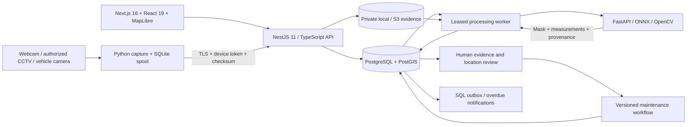

# RoadWatch

Road-condition observations, geospatial review and accountable maintenance in one
web application. This is a working multi-service codebase with durable storage,
real model adapters, an offline camera collector, deployment files and automated
tests. Field qualification requires actual devices, permitted maps and a validated
model; the included demonstration is not a claim about real road hazards.

## Run locally

Requirements: Node.js 24, Python 3.12, npm, uv, PostgreSQL 14+.

```sh
npm run setup
npm run dev
```

Open **http://localhost:3000**. Generated administrator and local team credentials
are in **`.local/credentials.txt`**. Secrets, evidence, model weights and local
database files are excluded from Git. Setup preserves existing credentials.

The local database uses port 55432; API 3001; vision 8001; web 3000. See
[deployment and recovery instructions](docs/DEPLOYMENT.md) for containers, HTTPS,
S3, process management and remaining operational acceptance work.

## What is implemented

| Area | Working behavior |
|---|---|
| Web workspace | Responsive overview/map, defect evidence review, road registry, fleet, surveys/camera capture, work orders, reports, administration |
| Identity | Persistent HttpOnly sessions, five roles, tenant checks, browser-origin protection, login limits, user activation/password management |
| Roads | Validated GeoJSON import, named assets, ownership/regions, 100m segments, coordinates, chainage and proximity checks |
| Defects | Eight supported road-damage categories, manual and model observations, units, null unknown measurements, reasoned scheduling priority |
| Evidence | Private media, SHA-256 verification, bounded uploads, local or S3 storage, authenticated playback and frame/mask provenance |
| Detection | FastAPI + ONNX Runtime, YOLOv8 box/segmentation adapters, explicit custom ONNX contract, optional RF-DETR-Seg Small adapter |
| Capture | Browser camera/file upload; separate Python webcam/RTSP collector with durable SQLite spool, recovery and device authentication |
| Geolocation | Calibration and synchronized trajectory geometry, unlocated-observation review, manual placement without invented accuracy |
| Processing | Persisted leased jobs, retry budgets, checksum quarantine, idempotent upload/result commits, retained failures |
| Maintenance | Confirm → assign → start → report repair → independent verification; version conflicts and atomic defect/order state changes |
| Automation | Transactional outbox, persistent internal notifications, overdue work-order monitoring and acknowledgements |
| Reporting | CSV with spreadsheet-formula protection, GeoJSON and JSON snapshots, audit trail, organization policy recalculation |
| Delivery | npm workspaces, Docker Compose, GitHub Actions configuration, browser/API/Python tests, backup helper |

## Stack and data flow



Next.js handles the browser application. NestJS modules own operational APIs and
authorization. Python owns decoding, inference and geometry because that is where
the relevant numerical/model tooling is maintained. Shared TypeScript domain code
keeps API and UI units, statuses and priority rules consistent. PostgreSQL supplies
durable transactions, leases and audit state. PostGIS is required in the container
deployment; local startup explicitly reports approximate spatial mode if absent.

RabbitMQ, Temporal and Kubernetes are architectural expansion options from the
design study, not unused mandatory services. The implemented queue uses SQL leases
and transaction fencing; lifecycle state is persisted in the database. This keeps
the chosen operational stack concrete and testable.

## Model setup

No downloaded model is silently treated as production approved. Without a manifest,
inference returns an explicit HTTP 503 and preserves uploaded evidence for review/retry.

An optional, pinned **experimental pothole segmentation** baseline can run locally:

```sh
.venv/bin/python scripts/download-baseline.py
```

Set the printed manifest path as `VISION_MODEL_MANIFEST` and set
`VISION_ALLOW_EXPERIMENTAL_MODEL=true` in the local `.env`; restart the application.
The artifact's embedded AGPL-3.0 license conflicts with its publisher's MIT label,
and its training dataset is not supplied. Read the
[baseline notice](models/BASELINE-NOTICE.md). Production rejects experimental models.
This one-class baseline does not recognize every defect class in the application.
With the model enabled, `npm run smoke:model` verifies real inference through the
web/API pipeline using an attributed public-domain photo. The result stays unlocated
in a clearly named demonstration survey because its road location is unknown.

[Vision documentation](services/vision/README.md) specifies the supported tensors,
calibration/trajectory schemas, data preparation, training and evaluation commands.
[Edge documentation](services/edge/README.md) specifies device capture and offline
delivery. No external GitHub model code or unsafe pickle is automatically executed.

## Measurement and decision rules

- A road/segment ID and chainage identify the relevant asset. A map marker alone
  does not establish road ownership, lane identity or surveyed precision.
- Vehicle GPS is retained as camera/antenna metadata. Defect GPS needs calibrated
  projection and synchronized pose, or an explicitly estimated reviewer location.
- RGB does not measure pothole cavity depth or pavement-layer thickness. Unknown
  length/width/depth remains `null`, with a reason; zero is a different measurement.
- The reference priority formula combines physical severity, traffic, vulnerable
  road users, deterioration and unresolved age. Unknown severity requests inspection
  using conservative assumptions. Detector confidence does not reduce urgency.
- Reference thresholds and weights need approval by the road authority. The score
  is not a certified pavement condition index or an autonomous repair order.
- Separate nearby observations are retained as candidates with possible-duplicate
  hints; proximity alone is insufficient to merge two potholes.
- New road imports start with zero known coverage. Detection-free images do not
  automatically prove a whole segment is healthy. Automatic survey-coverage
  measurement and field-certified PCI/IRI are outside the current sensor integration.

## Verification

With the application running:

```sh
npm run build
npm test
npm run test:vision
npm run test:integration
npx playwright install chromium
npm run test:e2e
```

The test suite uses explicitly synthetic fixtures to exercise contracts and
workflows; it does not advertise benchmark accuracy. See
[validation evidence](docs/VALIDATION.md) for the actual checks executed and limits.
The GitHub Actions definition must still run on your GitHub repository; it has not
been submitted remotely by this workspace.

## Repository guide

```text
apps/web             Next.js interface and same-origin API proxy
apps/api             NestJS modules, migrations, auth, jobs and maintenance
apps/automation      Durable internal notifications and overdue-order worker
packages/domain      Shared types, scoring, geography and lifecycle invariants
packages/storage     Private local and S3 evidence drivers
services/vision      Inference, calibration, dataset/training/evaluation tools
services/edge        Camera acquisition, local spool and upload recovery
scripts              Setup, startup, model download, backup and validation
infra                Container images, TLS and storage configuration examples
tests                API integration and browser scenarios
docs                 Contracts, deployment and validation records
```

The full [architecture and research report](road-condition-system-design.docx)
covers government data, mapping sources, GPS/metrology, maintenance policy,
infrastructure and rollout. Official authority geometry, CCTV permission, camera
calibration, measured road defects, approved model weights and a deployment account
are external inputs; none are fabricated by the implementation.
